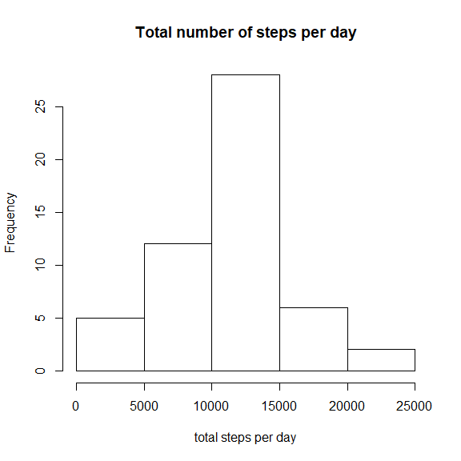
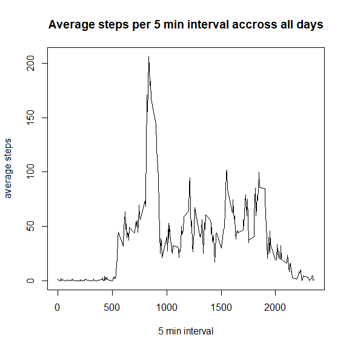
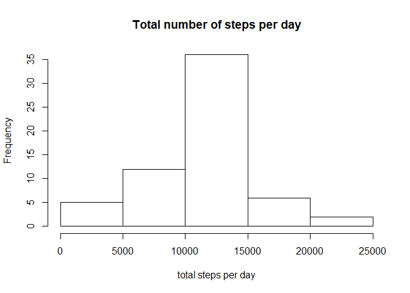
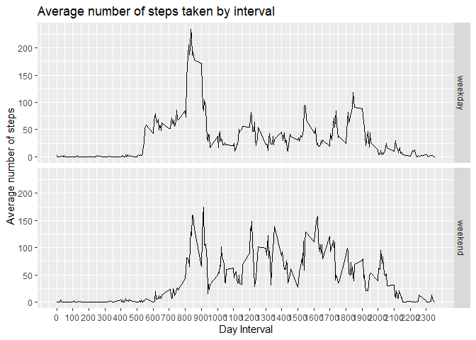

## Loading and preprocessing the data
1. code for reading in the dataset and/or processing the data

```r
setwd("D:\\Documents\\gitrepos\\lisa_github\\RepData_PeerAssessment1")
library(dplyr)
```

```
## 
## Attaching package: 'dplyr'
```

```
## The following objects are masked from 'package:stats':
## 
##     filter, lag
```

```
## The following objects are masked from 'package:base':
## 
##     intersect, setdiff, setequal, union
```

```r
library(ggplot2)
data = read.csv('activity.csv', na.strings = "NA")
data$date = as.Date(data$date, "%Y-%m-%d")
dim(data)
```

```
## [1] 17568     3
```

```r
head(data)
```

```
##   steps       date interval
## 1    NA 2012-10-01        0
## 2    NA 2012-10-01        5
## 3    NA 2012-10-01       10
## 4    NA 2012-10-01       15
## 5    NA 2012-10-01       20
## 6    NA 2012-10-01       25
```


## What is mean total number of steps taken per day?
2. histogram of the total number of steps taken each day

```r
total_steps_per_day = tapply(data$steps, data$date, sum)
total_steps_per_day
```

```
## 2012-10-01 2012-10-02 2012-10-03 2012-10-04 2012-10-05 2012-10-06 2012-10-07 
##         NA        126      11352      12116      13294      15420      11015 
## 2012-10-08 2012-10-09 2012-10-10 2012-10-11 2012-10-12 2012-10-13 2012-10-14 
##         NA      12811       9900      10304      17382      12426      15098 
## 2012-10-15 2012-10-16 2012-10-17 2012-10-18 2012-10-19 2012-10-20 2012-10-21 
##      10139      15084      13452      10056      11829      10395       8821 
## 2012-10-22 2012-10-23 2012-10-24 2012-10-25 2012-10-26 2012-10-27 2012-10-28 
##      13460       8918       8355       2492       6778      10119      11458 
## 2012-10-29 2012-10-30 2012-10-31 2012-11-01 2012-11-02 2012-11-03 2012-11-04 
##       5018       9819      15414         NA      10600      10571         NA 
## 2012-11-05 2012-11-06 2012-11-07 2012-11-08 2012-11-09 2012-11-10 2012-11-11 
##      10439       8334      12883       3219         NA         NA      12608 
## 2012-11-12 2012-11-13 2012-11-14 2012-11-15 2012-11-16 2012-11-17 2012-11-18 
##      10765       7336         NA         41       5441      14339      15110 
## 2012-11-19 2012-11-20 2012-11-21 2012-11-22 2012-11-23 2012-11-24 2012-11-25 
##       8841       4472      12787      20427      21194      14478      11834 
## 2012-11-26 2012-11-27 2012-11-28 2012-11-29 2012-11-30 
##      11162      13646      10183       7047         NA
```

```r
hist(total_steps_per_day, xlab = "total steps per day", main = "Total number of steps per day")
```

<!-- -->

3. mean and median number of steps taken each day

```r
# mean 
mean(total_steps_per_day, na.rm = TRUE)
```

```
## [1] 10766.19
```

```r
# median
median(total_steps_per_day, na.rm = TRUE)
```

```
## [1] 10765
```

## What is the average daily activity pattern?
4. time series plot of the average number of steps taken

```r
dim(data)
```

```
## [1] 17568     3
```

```r
data_full = data[complete.cases(data),]
dim(data_full)
```

```
## [1] 15264     3
```

```r
ave_steps_per_interval = tapply(data_full$steps, data_full$interval, mean)
length_interval = length(unique(data_full$interval))
plot(data_full$interval[1:length_interval], ave_steps_per_interval, type = 'l', xlab = '5 min interval', ylab = 'average steps', main = 'Average steps per 5 min interval accross all days')
```

<!-- -->

5. which 5-minute interval that, on average, accorss all the days in the dataset, contains the maximum number of steps

```r
the_interval = as.numeric(which.max(ave_steps_per_interval))
data$interval[the_interval]
```

```
## [1] 835
```

## Imputing missing values
6. code to describe and show a strategy for imputing missing data

```r
# total missing values
print(sum(is.na(data$date)))
```

```
## [1] 0
```

```r
print(sum(is.na(data$interval)))
```

```
## [1] 0
```

```r
total_missing_values = sum(is.na(data))
print(total_missing_values)
```

```
## [1] 2304
```

```r
# using the mean value of the 5-min interval to impute the missing values
data_imputed = data

for (i in 1: dim(data)[1]) {
  if(is.na(data$steps[i])) {data_imputed$steps[i]=mean(data[data$interval==data$interval[i],1], na.rm = TRUE)}
}
sum(complete.cases(data_imputed))
```

```
## [1] 17568
```

```r
total_steps_per_day = tapply(data_imputed$steps, data_imputed$date, sum)

hist(total_steps_per_day, xlab = "total steps per day", main = "Total number of steps per day")
```

<!-- -->

```r
# mean total number of steps taken per day
mean(total_steps_per_day)
```

```
## [1] 10766.19
```

```r
# median total number of steps taken per day
median(total_steps_per_day)
```

```
## [1] 10766.19
```

```r
# the mean value does not differ from the estimates from the first part of the assignment since we used mean to impute the missing data, but the median value is different from the first part. The impact of imputing missing data on the estimates of the total daily number of steps is that it increases the value of the total daily number of steps.
```


## Are there differences in activity patterns between weekdays and weekends?

```r
# create a new factor variable in the dataset 
data$weekdayclass <- ifelse(weekdays(as.Date(data$date)) %in% c('Saturday', 'Sunday'), 'weekend', 'weekday')
```

8. panel plot comparing the average number of steps taken per 5-minute interval across weekdays and weekends

```r
interval_mean <- data %>% group_by(interval, weekdayclass) %>% summarise(mean_step = mean(steps, na.rm = TRUE))
```

```
## `summarise()` regrouping output by 'interval' (override with `.groups` argument)
```

```r
fig <- ggplot(interval_mean, aes(interval, mean_step)) + geom_line() + facet_grid(weekdayclass ~ .) + scale_x_continuous("Day Interval", breaks = seq(min(interval_mean$interval), max(interval_mean$interval), 100)) + scale_y_continuous("Average number of steps") + ggtitle("Average number of steps taken by interval")
fig
```

<!-- -->


